# Photo Service GUI - Architecture Documentation

> **Generated**: 2026
> **Target Audience**: Technical leads and architects
> **Documentation Level**: High detail (design patterns, interfaces, deployment)
> **Standard**: C4 Model (Context, Container, Component, Code)

## Quick Navigation

### 📋 Core Architecture
- [01 - Architecture Overview](01_architecture_overview.md) - System design principles and layers
- [02 - C4 Context Diagram](02_c4_context.md) - System scope and external dependencies

## 🎯 Project Summary

**Photo Service GUI** is a web-based administration interface for managing photo and video operations during sporting events. It enables:

✅ Video stream capture and management
✅ AI-based detection of race participants crossing the finish line
✅ Photo browsing, annotation, and archiving
✅ Google Cloud Storage integration for photo/video storage
✅ Google Live Stream API integration for SRT video capture
✅ Real-time video analytics monitoring
✅ Service instance lifecycle management

### 🏛️ Architecture Pattern

```mermaid
graph LR
    User["👤 User<br/>(Event Admin)"]
    Browser["🌐 Browser"]
    WebServer["🖥️ Web Server<br/>(Gunicorn/aiohttp)"]
    Views["📄 Views<br/>(Request Handlers)"]
    Services["⚙️ Services<br/>(Business Logic)"]
    Adapters["🔗 Adapters<br/>(Service Integration)"]
    Microservices["🔧 Microservices<br/>(Event, User,<br/>Photo, etc.)"]
    GCS["☁️ Google Cloud<br/>Storage"]

    User -->|interacts| Browser
    Browser -->|HTTP/HTTPS| WebServer
    WebServer -->|routes| Views
    Views -->|calls| Services
    Services -->|delegates| Adapters
    Adapters -->|REST API| Microservices
    Adapters -->|GCS API| GCS

    classDef user fill:#50C878,stroke:#2D7A4A,stroke-width:2px,color:#fff
    classDef client fill:#9B59B6,stroke:#6C3A6F,stroke-width:2px,color:#fff
    classDef server fill:#3498DB,stroke:#2874A6,stroke-width:2px,color:#fff
    classDef service fill:#E67E22,stroke:#A04000,stroke-width:2px,color:#fff
    classDef data fill:#E74C3C,stroke:#A93226,stroke-width:2px,color:#fff

    class User user
    class Browser client
    class WebServer,Views,Services,Adapters server
    class Microservices service
    class GCS data
```

## 🛠️ Technology Stack

| Component | Technology |
|---|---|
| **Framework** | aiohttp (async Python web framework) |
| **Language** | Python 3.13+ |
| **Frontend** | Jinja2 templates, HTML5, CSS3, JavaScript |
| **Authentication** | JWT tokens + encrypted session cookies |
| **Cloud Storage** | Google Cloud Storage |
| **Video Streaming** | Google Live Stream API (SRT) |
| **Server** | Gunicorn + aiohttp |
| **Containerization** | Docker |
| **Configuration** | Environment variables + JSON files |

## 📊 Key Statistics

- **Views**: 7 main views (Main, Config, Login, Logout, Photos, Status, VideoEvents)
- **Services/Adapters**: 13 adapter and service classes
- **External Services**: 5 microservices + Google Cloud Storage
- **Code Layers**: 4 (Templates, Views, Services, Adapters)

## 🚀 Deployment

### Development
Docker Compose with local services

### Staging/Production
Docker / Kubernetes with:
- Load balancing
- Google Cloud Storage for media
- Google Cloud Live Stream API for SRT capture
- SSL/TLS encryption

## 🔑 Key Design Principles

1. **Separation of Concerns**: Clear layer boundaries (View → Service → Adapter)
2. **Async-First**: Non-blocking I/O for high concurrency
3. **Adapter Pattern**: Decoupled microservice and cloud service integration
4. **Configuration-Driven**: Environment-based multi-environment support
5. **Stateless Design**: Enables horizontal scaling

## 📚 Documentation Structure

Each document in this architecture follows the **C4 Model**:

- **Context**: What the system does and who uses it
- **Containers**: Technologies and deployment containers
- **Components**: Internal modules and their responsibilities
- **Code**: Implementation details (class, function level)

## 🎓 Reading Guide

**New to the project?** Start here:
1. [Architecture Overview](01_architecture_overview.md) - Understand the design
2. [C4 Context](02_c4_context.md) - See the big picture

**Need to understand video capture?**
→ See [Architecture Overview](01_architecture_overview.md) - Video Capture section

**Integrating a new service?**
→ Read [C4 Context](02_c4_context.md) - External Systems section

## 📞 Maintainers

- Architecture: Technical Leads
- Documentation: Development Team
- Last Updated: 2026

---

**Next Step**: Start with [Architecture Overview](01_architecture_overview.md) for a complete understanding of the system design.
