# Architecture Overview

## System Design Principles

The Photo Service GUI follows a **layered architecture pattern** with clear separation of concerns across four distinct layers:

```mermaid
graph TB
    subgraph Presentation["📱 PRESENTATION LAYER"]
        Templates["HTML, CSS, JavaScript<br/>Jinja2 Template Rendering<br/>User Interface & Forms"]
    end

    subgraph Views["🔀 VIEWS LAYER"]
        Routing["Route Matching<br/>Request Handling<br/>Parameter Extraction<br/>aiohttp View Classes"]
    end

    subgraph Services["⚙️ SERVICES LAYER"]
        Business["Validation<br/>Business Rules<br/>Service Composition<br/>Adapter Orchestration"]
    end

    subgraph Adapters["🔗 ADAPTERS LAYER"]
        Integration["External Service Abstraction<br/>HTTP Clients<br/>GCS Client<br/>Response Transformation<br/>Error Handling"]
    end

    subgraph External["🌐 EXTERNAL SYSTEMS"]
        Microservices["Event Service<br/>User Service<br/>Photo Service<br/>Config/Status Service"]
        GCS["Google Cloud Storage<br/>Google Live Stream API"]
    end

    Templates -->|renders forms| Routing
    Routing -->|orchestrates| Business
    Business -->|delegates| Integration
    Integration -->|REST API| Microservices
    Integration -->|GCS SDK / REST| GCS

    classDef presentation fill:#FF6B6B,stroke:#C92A2A,stroke-width:2px,color:#fff
    classDef viewslayer fill:#4ECDC4,stroke:#0A8A84,stroke-width:2px,color:#fff
    classDef service fill:#95E1D3,stroke:#38A169,stroke-width:2px,color:#000
    classDef adapter fill:#FFE66D,stroke:#DD6B20,stroke-width:2px,color:#000
    classDef external fill:#95BDFF,stroke:#1971C2,stroke-width:2px,color:#fff

    class Templates presentation
    class Routing viewslayer
    class Business service
    class Integration adapter
    class Microservices,GCS external
```



## Architectural Goals

### 1. **Modularity**
- Each service adapter is independently testable
- Views are loosely coupled to underlying data structures
- Services enforce business logic boundaries
- Clear responsibility separation

### 2. **Asynchronicity**
- All I/O operations are non-blocking using async/await
- Efficient handling of concurrent user sessions
- Improved throughput and responsiveness
- aiohttp for async HTTP client and server

### 3. **Maintainability**
- Clear separation of concerns across layers
- Adapter pattern for external integrations
- Configuration-driven behavior via environment variables
- Consistent error handling patterns

### 4. **Scalability**
- Stateless design enables horizontal scaling
- JWT-based authentication (no session affinity needed)
- Load balancer compatible
- Google Cloud Storage scales automatically

## Request Processing Flow

```
1. User Action (Browser)
        ↓
2. HTTP Request arrives at Gunicorn/aiohttp server
        ↓
3. View Layer
   ├─ Route matching (URL → View class)
   ├─ Parameter extraction from URL/form/JSON
   ├─ Session/Authentication check
   └─ Call appropriate Service or Adapter
        ↓
4. Service Layer (Business Logic)
   ├─ Validate input parameters
   ├─ Apply business rules
   ├─ Coordinate multiple adapters if needed
   └─ Delegate to Adapters
        ↓
5. Adapter Layer (Integration)
   ├─ Build HTTP request to external service OR call GCS SDK
   ├─ Include authentication headers (JWT)
   ├─ Parse response
   ├─ Handle errors (retry, timeout, validation)
   └─ Return typed response
        ↓
6. External System (Microservice or Google Cloud)
   └─ Process request, return data
        ↓
7. Response bubbles back through layers
        ↓
8. Template Rendering
   ├─ Render Jinja2 template with returned data
   ├─ Apply CSS styling
   ├─ Include inline JavaScript
   └─ Generate HTML
        ↓
9. HTTP Response to Browser
        ↓
10. Browser renders HTML to user
```

## Core Components

### Views (`views/`)
- HTTP request handlers using aiohttp's `View` class
- One view class per major feature area
- Responsibilities:
  - Route matching and HTTP method handling
  - Session and authentication validation
  - Parameter extraction and validation
  - Service and adapter invocation
  - Template rendering

| View | Purpose |
|---|---|
| `Main` | Event selection and management landing page |
| `Config` | Event configuration settings |
| `Login` / `Logout` | Authentication |
| `Photos` | Photo browsing, archiving, and deletion |
| `Status` | System and service status monitoring |
| `VideoEvents` | Video stream management and analytics |
| `Ping` | Health check endpoint |

### Services (`services/`)
- Business logic orchestration and cloud service integration
- Compose adapters for complex operations

| Service | Purpose |
|---|---|
| `FotoService` | Photo lifecycle management (star, annotate, delete) |
| `LiveStreamService` | Google Live Stream API channel management (SRT) |

### Adapters (`services/*_adapter.py`)
- Abstract external microservice HTTP APIs and cloud SDKs
- Implement the **Adapter design pattern**

| Adapter | Purpose |
|---|---|
| `EventsAdapter` | Event data (CRUD) via Event Service REST API |
| `UserAdapter` | Authentication and user management |
| `PhotosAdapter` | Photo metadata via Photo Service REST API |
| `AlbumsAdapter` | Album management via Photo Service REST API |
| `ConfigAdapter` | Event configuration key-value store |
| `StatusAdapter` | Service status messages |
| `ServiceInstanceAdapter` | Video service instance lifecycle |
| `GoogleCloudStorageAdapter` | Photo/video file storage in GCS |
| `PhotosFileAdapter` | Local file queue management |
| `LiveStreamAdapter` | Google Live Stream API (low-level) |
| `CompetitionFormatAdapter` | Competition format data |

### Templates (`templates/`)
- Jinja2 template files for HTML rendering
- Template inheritance for code reuse
- Client-side JavaScript for interactive video status polling

### Configuration (`photo_service_gui/config/`)
- JSON files for static configuration
- `global_settings.json` - System-wide settings

## Video Capture Architecture

The system supports two video capture modes:

### Mode 1: Local Capture
```
Camera/RTSP stream
        ↓
Local capture process (cv2)
        ↓
Local filesystem queue
        ↓
AI detection (YOLO / image analysis)
        ↓
Google Cloud Storage (CAPTURE/ folder)
        ↓
Photo Service (metadata storage)
```

### Mode 2: Cloud Capture (SRT / Google Live Stream API)
```
Camera/encoder
        ↓ SRT Push
Google Live Stream API Input Endpoint
        ↓
Google Live Stream API Channel
        ↓
Google Cloud Storage (clips)
        ↓
Photo Service (metadata storage)
```

The `LiveStreamService` manages channels and inputs for Mode 2. Service instances
are tracked in the database via `ServiceInstanceAdapter`.

## Design Patterns Used

### 1. **Adapter Pattern**
Isolate external service dependencies in adapter classes:
- Views and Services don't know implementation details of external APIs
- Easy to mock adapters in tests
- Changes to external APIs contained to adapter layer
- Clear contract between layers

### 2. **Facade Pattern**
Services provide simplified interfaces to complex multi-adapter operations:
- `FotoService` hides multi-step photo management workflows
- `LiveStreamService` hides Google Live Stream API complexity

### 3. **MVC Pattern (Conceptual)**
- Views = Template files (presentation logic)
- Controller = View classes in views/ (routing + orchestration)
- Model = Service layer (business logic) + Adapters (data access)

### 4. **Template Method Pattern**
Jinja2 template inheritance:
- Base templates define overall page structure
- Specific pages inherit and override blocks

## Key Technologies

| Component | Technology | Purpose |
|---|---|---|
| **Framework** | aiohttp | Async HTTP web framework |
| **Language** | Python 3.13+ | Implementation language |
| **Templates** | Jinja2 | HTML template rendering |
| **Authentication** | JWT | Token-based authentication |
| **Sessions** | Encrypted Cookies | Session state storage |
| **Cloud Storage** | Google Cloud Storage | Photo and video file storage |
| **Video Streaming** | Google Live Stream API | Cloud SRT video capture |
| **Server** | Gunicorn | WSGI/application server |
| **Async Runtime** | asyncio | Python async event loop |

## Authentication & Authorization Flow

### Login Process
```
1. User POST login form (username, password)
       ↓
2. UserAdapter.login() → User Service
       ↓
3. User Service validates credentials
       ↓
4. Returns JWT token
       ↓
5. GUI stores JWT in encrypted session cookie
```

### Token Validation
```
Every Protected Request:
1. Extract token from session cookie
2. Include in Authorization header: 'Bearer {token}'
3. Invalid/expired token → redirect to login
```

## Error Handling Strategy

### Multi-Layer Error Handling
```
1. View Layer
   ├─ Authentication checked
   ├─ Parameters validated
   └─ Redirects to login on 401

2. Service Layer
   ├─ Business rule violations caught
   └─ Multi-step operation failures handled

3. Adapter Layer
   ├─ Network errors handled
   ├─ GCS Forbidden/NotFound exceptions caught
   └─ External service errors transformed to exceptions

4. Global Error Handler
   ├─ Uncaught exceptions logged to error.log
   └─ User-friendly redirect with error message
```

## Configuration Management

### Levels (Priority Order)
```
1. Environment Variables (highest)
   ├─ Service endpoints
   ├─ Google Cloud credentials
   ├─ Storage bucket name
   └─ Secrets (JWT, Fernet)

2. JSON Config Files
   └─ global_settings.json

3. Code Defaults (lowest)
   └─ Fallback values
```

### Key Environment Variables

| Variable | Purpose |
|---|---|
| `EVENTS_HOST_SERVER` / `EVENTS_HOST_PORT` | Event Service endpoint |
| `PHOTOS_HOST_SERVER` / `PHOTOS_HOST_PORT` | Photo Service endpoint |
| `USERS_HOST_SERVER` / `USERS_HOST_PORT` | User Service endpoint |
| `GOOGLE_STORAGE_BUCKET` | GCS bucket name |
| `GOOGLE_CLOUD_PROJECT` | GCP project ID |
| `GOOGLE_APPLICATION_CREDENTIALS` | GCP service account key |
| `FERNET_KEY` | Session cookie encryption key |
| `JWT_SECRET` | JWT signing secret |

## Security Architecture

### At a Glance
```
HTTPS/TLS
    ↓
Load Balancer (SSL termination)
    ↓
Web Server (Gunicorn)
    ↓
Encrypted Session Cookies
    ↓
JWT Token Validation
    ↓
Google Cloud IAM (for GCS/Live Stream)
```

### Key Security Features
- HTTPS/TLS for all external communications
- JWT tokens for stateless authentication
- Encrypted session cookies (Fernet encryption)
- Environment variable secrets (not in code)
- Google Cloud IAM for storage access control

## Deployment Topology

### Development
Single machine with all services locally via Docker Compose

### Production
```
Users
  ↓ HTTPS:443
Load Balancer
  ↓ HTTP:8096
[GUI Instance 1]
[GUI Instance 2]
  ↓
Microservices          Google Cloud
├─ Event Service       ├─ Cloud Storage
├─ User Service        └─ Live Stream API
├─ Photo Service
└─ Status/Config Service
```

---

**Next**: Review [C4 Context Diagram](02_c4_context.md) to see system scope and external systems.
