# C4 Context Diagram: System Scope

## What is C4 Context?

The **C4 Context diagram** shows:
- The system being documented (Photo Service GUI)
- Who uses it (actors/users)
- What external systems it interacts with
- High-level data flows

## Functional Context (Business View)

What does the system actually do? Here's the functional perspective without technical detail:


**Key Capabilities**:
- ✅ Video stream capture configuration and control
- ✅ AI-powered detection of race participant crossings
- ✅ Photo browsing, annotation, and archiving
- ✅ Google Cloud Storage integration for media files
- ✅ Google Live Stream API (SRT) for cloud-native capture
- ✅ Real-time analytics and service status monitoring

---

## Technical Context (System Integration View)

```mermaid
graph TB
    subgraph Users["👤 Users"]
        Admin["Event Administrator<br/>(Race Director, Photo Operator)<br/>Manages video capture, photo<br/>review, and event configuration"]
    end

    subgraph WebTech["🌐 Client Technology"]
        Browser["Web Browser<br/>(Chrome, Firefox, Safari, Edge)"]
    end

    subgraph SystemBoundary["🏢 Photo Service GUI System"]
        direction TB
        GUI["<b>Photo Service GUI</b><br/>Web-based Photo & Video Operations Interface<br/>aiohttp • Python 3.13+<br/>Jinja2 Templates • JWT Auth"]
    end

    subgraph Services["🔧 Microservices Ecosystem"]
        direction TB
        EventSvc["📊 Event Service<br/>Core event data<br/>Port: 8082"]
        UserSvc["👥 User Service<br/>Authentication & users<br/>Port: 8086"]
        PhotoSvc["📸 Photo Service<br/>Photo metadata storage<br/>Port: 8092"]
        StatusSvc["📡 Status/Config Service<br/>Config & status messages<br/>Port: (configured)"]
    end

    subgraph GoogleCloud["☁️ Google Cloud"]
        GCS["Google Cloud Storage<br/>Photo & video file storage"]
        LiveStream["Google Live Stream API<br/>SRT video capture"]
    end

    Admin -->|"uses web browser"| Browser
    Browser -->|"HTTP/HTTPS (Port 8096)"| GUI
    GUI -->|"REST API (JSON)"| EventSvc
    GUI -->|"REST API (JSON)"| UserSvc
    GUI -->|"REST API (JSON)"| PhotoSvc
    GUI -->|"REST API (JSON)"| StatusSvc
    GUI -->|"GCS SDK / REST"| GCS
    GUI -->|"REST API"| LiveStream

    classDef user fill:#50C878,stroke:#2D7A4A,stroke-width:2px,color:#fff
    classDef system fill:#4A90E2,stroke:#2E5C8A,stroke-width:3px,color:#fff
    classDef service fill:#FF9500,stroke:#994D00,stroke-width:2px,color:#fff
    classDef cloud fill:#EE5A6F,stroke:#8A2335,stroke-width:2px,color:#fff
    classDef browser fill:#9B59B6,stroke:#6C3A6F,stroke-width:2px,color:#fff

    class Admin user
    class Browser browser
    class GUI system
    class EventSvc,UserSvc,PhotoSvc,StatusSvc service
    class GCS,LiveStream cloud
```



## Users/Actors

### **Event Administrator / Photo Operator**
**Who**: Race directors, event organizers, photo and video operators

**Responsibilities**:
- Select and configure the active event
- Configure video stream URL and AI detection settings
- Start and stop video capture service instances
- Monitor AI detection analytics and capture queue status
- Browse and manage captured photos
- Annotate photos with race bib numbers
- Archive or delete photos

**Access**: Web browser, authenticated via login

**Frequency**: Throughout the event, especially during races

## System Responsibilities

### What Photo Service GUI Does ✅

1. **Event Selection**
   - List and select the active sporting event
   - Sync event data from the Event Service

2. **Video Configuration**
   - Set video stream URL (RTSP, HTTP, SRT)
   - Configure AI trigger line (detection zone)
   - Set video clip duration, FPS, and resolution
   - Select storage mode (local or cloud)

3. **Video Capture Control**
   - Start/stop video service instances (SRT via Google Live Stream API)
   - Monitor capture queue lengths (local and cloud)
   - View real-time analytics status messages

4. **Photo Management**
   - Browse captured photos from Google Cloud Storage
   - Filter photos by type (DETECT, DETECT_ARCHIVE, CAPTURE)
   - Move photos between folders (archive / inbox)
   - Delete selected photos

5. **Photo Annotation**
   - View and update bib number lists for detected photos
   - Star/unstar important photos

6. **System Monitoring**
   - View status and error messages from all services
   - Monitor service instance health (Live Stream channel states)

### What Photo Service GUI Does NOT Do ❌

- **Store photo files directly** (delegates to Google Cloud Storage)
- **Store photo metadata directly** (delegates to Photo Service)
- **Perform AI detection** (done by external capture/detection processes)
- **Store event data** (delegates to Event Service)
- **Authenticate users independently** (delegates to User Service)

## External Systems & Dependencies

### **1. Event Service**
**Type**: Microservice REST API
**Port**: 8082 (default)
**Purpose**: Core event data management

**Interactions**:
- GET all events
- Sync events from remote server
- Delete events

**Failure Impact**: 🔴 Critical - Cannot select or manage events

---

### **2. User Service**
**Type**: Microservice REST API
**Port**: 8086 (default)
**Purpose**: User authentication and management

**Interactions**:
- POST login (authentication)
- Validate JWT tokens
- Get user profile

**Failure Impact**: 🔴 Critical - Cannot authenticate users

---

### **3. Photo Service**
**Type**: Microservice REST API
**Port**: 8092 (default)
**Purpose**: Photo metadata storage and retrieval

**Interactions**:
- GET/POST/PUT/DELETE photo metadata
- GET photos by event, race, or race class
- GET/POST/DELETE albums

**Failure Impact**: 🟡 High - Cannot manage photo metadata, but GCS browsing still possible

---

### **4. Status/Config Service**
**Type**: Microservice REST API
**Purpose**: Key-value configuration store and status message log

**Interactions**:
- GET/PUT configuration values (VIDEO_URL, TRIGGER_LINE, etc.)
- GET status/analytics messages
- GET/POST service instance records

**Failure Impact**: 🟡 High - Cannot configure video or read analytics status

---

### **5. Google Cloud Storage**
**Type**: Cloud Object Storage
**SDK**: `google-cloud-storage` Python library
**Purpose**: Photo and video file storage

**Interactions**:
- List blobs (browse photos/clips by event and folder prefix)
- Upload blobs (photo/video files)
- Move blobs (archive/inbox management)
- Delete blobs

**Folders**:
- `{event_id}/CAPTURE/` - Newly captured frames
- `{event_id}/DETECT/` - AI-detected crossing frames (inbox)
- `{event_id}/DETECT_ARCHIVE/` - Archived detections
- `{event_id}/CAPTURE_ARCHIVE/` - Archived captures
- `{event_id}/CAPTURE_ERROR/` - Failed captures

**Failure Impact**: 🔴 Critical - Cannot view or manage photos

---

### **6. Google Live Stream API**
**Type**: Google Cloud REST API
**Purpose**: Cloud-native SRT video capture

**Interactions**:
- Create/start/stop/delete channels
- Create/delete SRT input endpoints
- Get channel status

**Failure Impact**: 🟡 High - SRT capture unavailable; local capture still possible

## Data Flows

### Example: Start SRT Video Capture

```
1. Admin opens VideoEvents page for an event
2. Admin clicks "Start SRT capture"
3. GUI (VideoEvents.post) receives form POST
4. LiveStreamService.create_and_start_channel() called
5.   ├─ ConfigAdapter reads clip duration, bitrate, resolution settings
6.   ├─ LiveStreamAdapter.create_input() → Google Live Stream API
7.   ├─ LiveStreamAdapter.create_channel() → Google Live Stream API
8.   ├─ LiveStreamAdapter.start_channel() → Google Live Stream API
9.   └─ ServiceInstanceAdapter.create_service_instance() → Status Service
10. SRT Push URL returned and displayed to admin
11. Admin configures camera/encoder with the SRT URL
12. Camera streams video → Google Live Stream API → GCS
```

### Example: Browse and Archive Photos

```
1. Admin navigates to /photos?event_id=xxx
2. GUI (Photos.get) called
3. GoogleCloudStorageAdapter.list_blobs(event_id, "") → GCS
4. Photos rendered in template with checkboxes
5. Admin selects photos to archive, clicks "Move to Archive"
6. GUI (Photos.post) receives form POST
7. For each selected photo in DETECT/:
8.   GoogleCloudStorageAdapter.move_blob(DETECT/x, DETECT_ARCHIVE/x) → GCS
9. Redirect back to photos page with result message
```

### Example: Monitor Live Analytics

```
Video analytics running:
Every poll (JavaScript interval):
1. Browser POSTs to /video_events with video_status
2. VideoEvents.post() called
3. StatusAdapter.get_status() → Status Service (last 8 messages)
4. PhotosFileAdapter.get_local_capture_queue_length() → local filesystem
5. GoogleCloudStorageAdapter.list_blobs(event_id, "CAPTURE/") → GCS
6. ConfigAdapter.get_config(LATEST_DETECTED_PHOTO_URL) → Status Service
7. ServiceInstanceAdapter.get_all_service_instances() → Status Service
8. LiveStreamService.get_channel_status() → Google Live Stream API
9. JSON response returned to browser
10. JavaScript updates dashboard display
```

## Communication Protocols

### Client ↔ GUI (HTML, HTTP/HTTPS)
- **Protocol**: HTTP/HTTPS
- **Port**: 8096 (HTTP) or 443 (HTTPS via reverse proxy)
- **Method**: Request/Response + JSON polling
- **Content-Types**: HTML, JSON, Form-encoded

### GUI ↔ Microservices (REST/JSON)
- **Protocol**: HTTP (internal network)
- **Method**: Request/Response (REST)
- **Content-Type**: JSON
- **Authentication**: JWT Bearer tokens
- **Async**: Yes (non-blocking calls)

### GUI ↔ Google Cloud Storage
- **Protocol**: HTTPS
- **SDK**: `google-cloud-storage` Python library
- **Authentication**: Google Application Default Credentials / Service Account
- **Operations**: Synchronous (wrapped in `asyncio.to_thread` where needed)

### GUI ↔ Google Live Stream API
- **Protocol**: HTTPS (Google Cloud REST API)
- **SDK**: `google-cloud-video-live-stream` Python library
- **Authentication**: Google Application Default Credentials
- **Operations**: Run via `asyncio.to_thread` to avoid blocking

## System Boundaries

### Inside the Boundary (GUI Scope)
✅ Presentation layer (templates)
✅ Request routing (views)
✅ Business logic orchestration (services)
✅ Service abstraction (adapters)
✅ User authentication/authorization
✅ Session management
✅ Configuration loading
✅ GCS file management (list, move, delete)
✅ Live Stream channel lifecycle management

### Outside the Boundary (Not GUI Responsibility)
❌ AI detection of race participants (external capture process)
❌ Photo metadata persistence (Photo Service)
❌ Event data persistence (Event Service)
❌ User credential validation (User Service)
❌ Video frame storage (Google Cloud Storage)
❌ Actual video encoding/transcoding (Google Live Stream API)

## Integration Assumptions

### Assumptions Made
1. ✅ All microservices available at configured endpoints
2. ✅ Google Cloud credentials configured via environment or service account
3. ✅ GCS bucket exists and is accessible
4. ✅ JWT token format compatible with User Service
5. ✅ Network connectivity between containers/services

### Failure Scenarios
- If Event Service unavailable → Cannot list events
- If User Service unavailable → Cannot authenticate
- If Photo Service unavailable → Cannot manage photo metadata
- If GCS unavailable → Cannot view or manage photos
- If Live Stream API unavailable → SRT capture unavailable
- If network partitioned → All remote calls fail

## Context Diagram Interpretation

The context diagram shows:

1. **One Actor** (Event Administrator / Photo Operator)
   - Interacts solely through web browser
   - Manages video capture and photo review

2. **One System** (Photo Service GUI)
   - Central hub for photo and video operations
   - Orchestrates calls to microservices and Google Cloud

3. **Four Microservices**
   - Independent deployment
   - Expose REST APIs
   - Can fail independently

4. **Two Google Cloud Services**
   - GCS for durable media storage
   - Live Stream API for cloud-native video capture

This diagram represents the **Context level** of the C4 model.

---

**Back to**: [Architecture Overview](01_architecture_overview.md)
